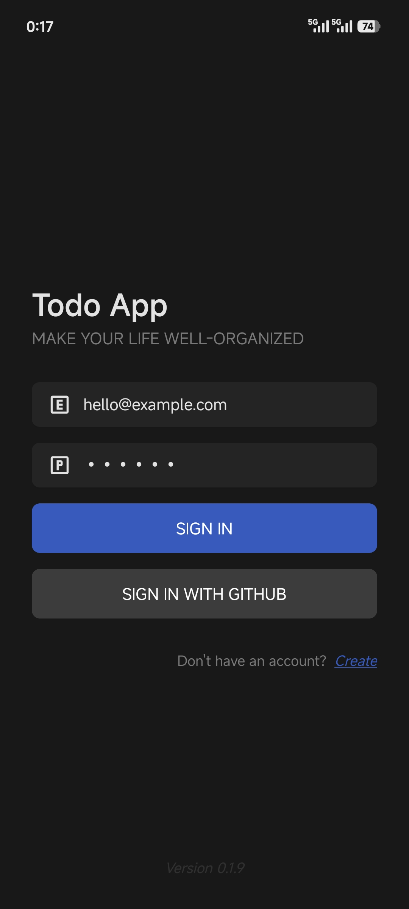
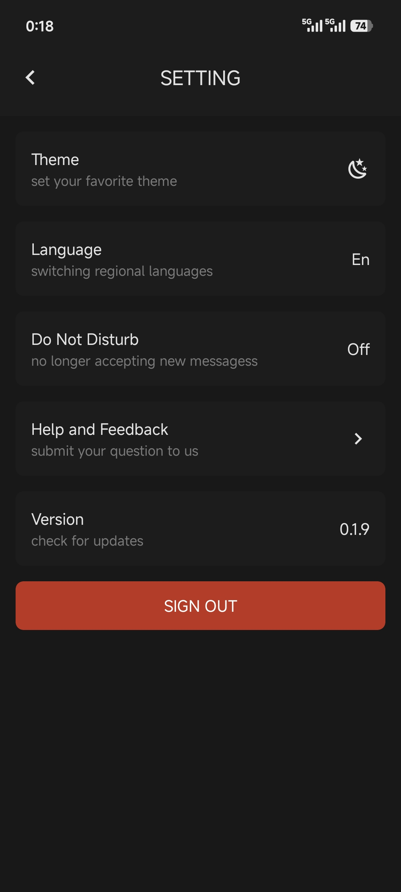

# Introduction

Monorepo root for the `postsop` React Native app, managed with `pnpm`.

## Getting started

```bash
pnpm install
pnpm start
pnpm android
pnpm ios
```

## Workspace plan

The repository uses:

- `apps/mobile` for the React Native application
- `packages/*` for shared packages

<div align="center">
  
  
  
  
</div>
